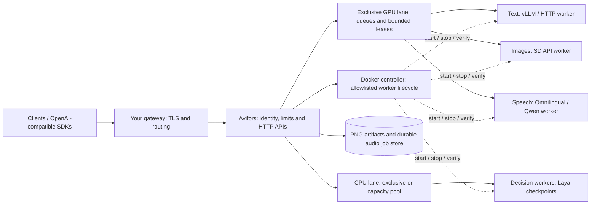

# Avifors

Demand-loaded inference on one GPU: keep your inference engines and API contracts,
share GPU residency between them, and bound how long one workload can monopolize it.

Avifors sits behind your existing OpenAI-compatible gateway. It supports vLLM,
stable-diffusion.cpp through an SD API adapter, and other HTTP workers controlled by
administrator-provided start/stop commands. It does not download models or replace
vLLM's token scheduler. This is a self-hosted Team AER project; there is no
hosted inference service in this repository.

[Project landing page](https://aer.app/avifors/) ·
[Docker deployment](deploy/README.md#docker-deployment) ·
[Speech guide](STT.md) · [Decision models](DECISION.md) ·
[Image profiles](FLUX2.md)

## Features

- **Demand-loaded residency:** activate the requested worker, drain and release it
  before handing the GPU to another model. Optional validated vLLM sleep reduces reload work.
- **Four scheduling policies:** latency, FIFO, measured-service-time fairness and
  throughput, with bounded ownership periods and per-request deadlines.
- **Multiple users:** bearer-key authentication, model allowlists, pending-work
  limits, separate administrator access and user-isolated generated artifacts.
- **Text and images:** pass-through OpenAI-compatible HTTP workers and an SD API
  adapter with persistent PNGs and administrator-defined render profiles.
- **Durable speech jobs:** optional Omnilingual/Qwen workers, chunk checkpoints,
  polling, cancellation, retries and text/JSON/SRT/VTT exports.
- **Decision workers:** typed choice, yes/no and score answers through the
  System One API; independent lanes can keep CPU models resident together.
- **Operations:** authenticated catalogs, scoped worker health, Prometheus metrics,
  aggregate residency state and optional OTLP/HTTP traces.

## How it works



The Docker controller has the Docker socket; the broker has only its Unix control
socket. The GPU lane owns one configured worker at a time. A lane with
`capacity_mib` uses pool scheduling and requires each model's `memory_mib`;
without a capacity it uses exclusive scheduling. Residency accounting is based
on administrator declarations, so validate memory use on the target hardware.
Workers, drivers and weights are separate dependencies. Regular pending inference
is volatile; the optional audio subsystem persists committed jobs and checkpoints.

## Install

Python 3.14+ is required. Production runs in Docker: see the
[Docker deployment](deploy/README.md#docker-deployment) and `deploy/docker/`. The Omnilingual
speech worker image is a temporary Python 3.12 exception (see [STT.md](STT.md)).

```sh
git clone https://github.com/Team-AER/avifors.git
cd avifors
python3.14 -m venv .venv
.venv/bin/pip install '.[test]'
export AVIFORS_USER_KEY='replace-with-a-long-random-secret'
export AVIFORS_ADMIN_KEY='replace-with-a-different-long-random-secret'
.venv/bin/avifors --config examples/config.yaml --check
.venv/bin/avifors --config examples/config.yaml
```

Adapt the example's model IDs, paths and worker commands first. Model weights,
inference runtimes and NVIDIA drivers are installed separately. The Docker deployment
runs the broker unprivileged and gives Docker access only to a root sidecar,
`avifors-controller`, which starts and stops allowlisted, labelled worker containers
for `avifors-workerctl`. The older systemd example and sudo helper remain in `deploy/`.
Configuration and worker commands are trusted administrator input, never API input.

## Multiple users

Configure named users whose bearer keys come from environment variables, per-user
model allowlists and pending-request limits. Model and global limits bound admission
across users. API keys are never forwarded to workers. With the `fair` policy,
measured service time selects between model queues and between users sharing a model;
aging prevents indefinite model starvation. Limits count queued and running work.
Use TLS at a reverse proxy when requests leave a trusted machine/network.

Authentication is required by default. Explicit `trusted_networks` can enable a
keyless private gateway integration; all such calls share the trusted-network quota.
Caller-supplied forwarding/user headers never establish identity. `/admin/state`
requires a separate administrator key. It reports residency and aggregate queues,
not prompts or user credentials. `/metrics` and `/v1/models` use inference auth.

## Scheduling

- `latency` (default): stop replenishing the active model when another model queues;
  drain running requests and switch. Use existing worker concurrency when uncontended.
- `fifo`: global arrival-order admission, batching only consecutive compatible jobs.
- `fair`: measured service-time fairness between models, weights and aging, and
  service-time selection between users within the selected model.
- `throughput`: replenish the current worker to amortize loading until the drain
  margin before its lease ends. At an idle boundary, switch to waiting other models.

Inference tuning is independent: the scheduler never changes text sampling, context,
quantization or vLLM batch settings. SD sampling is fixed by administrator configuration.

## Timeouts and cancellation

All timeouts are seconds. `idle_timeout` starts when inference completes, not when
health/metrics are queried. Competing work can unload a model before that timeout.
`max_hold` defaults to 300 and starts before activation; queue time is separate.
`max_runtime` defaults to 300, limited further by the current ownership epoch.
`activation_timeout` and `queue_timeout` are independently bounded.

At the hard deadline work is cancelled. A request admitted late in an epoch receives
only the remaining budget. No active request extends a lease. When no competing model
waits, an idle epoch can renew without physically reloading the same worker. Model
sleeping and idle residency do not mean outstanding generation can run indefinitely.

A queued client disconnect removes its request. An executing client disconnect
abandons delivery but drains the upstream response within the original deadline;
it does not reset other users' work. This may spend compute on an abandoned request.
At an execution deadline or worker failure, the broker resets the worker to prove
work stopped. **Other active requests on that worker may then fail.** There is no
transparent replay or mid-generation resume.
A streamed timeout produces an error event, never a successful fabricated finish.
A hung driver can exceed cleanup time; release failures disable admission rather than
starting a second owner. Pending requests are volatile and fail on broker restart.

## Worker lifecycle

Start/stop commands are argument arrays, not shell strings. Stops must be idempotent
and confirm termination. Configure `verify_stopped` for each worker and a global
`release_check` to enforce device-memory availability. A stop failure faults the
supervisor; fix the worker and restart the broker to reconcile all workers.

Set `sleep: true` only for a validated vLLM deployment launched with
`--enable-sleep-mode` and `VLLM_SERVER_DEV_MODE=1`. Level-1 sleep keeps weights in CPU
RAM and discards KV cache. Failed sleep falls back to stop. Workers and all vLLM
control endpoints must remain on loopback/private networks; only avifors is public.
See [vLLM sleep documentation](https://docs.vllm.ai/en/latest/features/sleep_mode/).

Broker startup and shutdown stop all configured workers. Disable their independent
restart/autostart policies. The systemd broker starts at boot with models unloaded;
real inference activates them. Probe `/v1/models` without loading anything. A scoped
`/backend/NAME/v1/models` returns failure for a faulted model (`parameters.route`
sets NAME); successful activation clears that fault. A global catalog does not
pretend that resident and available are the same thing.

## Images and persistence

`kind: sdapi` accepts OpenAI-shaped `POST /v1/images/generations`, n=1, URL output,
optional negative_prompt, and the documented sizes in the example. The adapter calls
`/sdapi/v1/txt2img` and writes PNGs atomically before returning. Authenticated artifact
reads work while the worker is unloaded and are isolated by user. `public_base` must
point to a route that serves or durably archives those images; the supplied route is
`/generated/NAME.png`. Set a trusted-network gateway to archive before acknowledging
if URLs must outlive the configurable local artifact TTL (default 24 hours).

For FLUX.2 Klein 9B FP8, see the [deployment guide](FLUX2.md) and
`deploy/flux2/` examples. Per-model render profiles support native resolutions and
higher-resolution rendering with exact legacy output dimensions.

OpenAI workers receive JSON/multipart bodies without sampling rewrites. Register
only supported paths. Existing response headers and W3C/request/session/workflow
context are forwarded; worker credentials, cookies and lifecycle endpoints are not.

Align gateway, SDK and caller deadlines with queue + activation + execution time.
A 180-second client cannot wait behind a 300-second request. Queue overflow returns
429; worker faults return 503; deadlines return 504 before response headers. A
request already streaming cannot change HTTP status. Disable automatic generation
retries if duplicate work is unacceptable.

## Deployment and validation

Use separate persistent model and compilation caches. Bind only required GPU devices
into an LXC, keep the host kernel driver, and install matching guest userspace. Do not
allow another container to use the managed GPU. Retain old workers/configuration for
rollback until text, images, switching, idle release and boot recovery are verified.

```sh
.venv/bin/python -m pytest -q
.venv/bin/ruff check avifors tests
```

Tests use fake workers and short clocks to exercise admission, cancellation,
streaming, authentication and lifecycle faults without a GPU. Real model performance,
GPU release and sleep compatibility must also be tested on the target hardware.

## Speech transcription

Optional multilingual speech workers share the same GPU scheduler. Durable audio
jobs accept multi-hour recordings, checkpoint progress, survive restarts, and
provide polling, cancellation and transcript/subtitle downloads through the
proxy. See [STT.md](STT.md) for the API, limits, retention, model/runtime setup and
quality limitations. The text and image runtime settings are independent.

## Decision models

`kind: decision` workers answer Ollama/Nimble-compatible `POST /v1/systemone` requests (typed
choice / yes-no / score questions, probabilities instead of text). Run them in their own `lane`
(e.g. `lane: cpu`) so decisions never evict the GPU-resident model. A lane with `capacity_mib`
keeps every model that fits resident together (pool mode, models declare `memory_mib`); lanes
without one keep exclusive single-owner scheduling. See [DECISION.md](DECISION.md).

## License and acknowledgements

[MIT](LICENSE) covers Avifors code only. Avifors integrates with independent
projects including [vLLM](https://github.com/vllm-project/vllm),
[stable-diffusion.cpp](https://github.com/leejet/stable-diffusion.cpp),
[Omnilingual ASR](https://github.com/facebookresearch/omnilingual-asr),
[Qwen3-ASR](https://github.com/QwenLM/Qwen3-ASR),
[Silero VAD](https://github.com/snakers4/silero-vad) and
[Laya](https://github.com/NandhaKishorM/laya). Thanks to their maintainers.
The worker guides record the relevant runtime and model revisions.

Inference engines, model weights and vendor dependencies
retain their own licenses. No weights, private configurations or credentials are
included in this repository.
